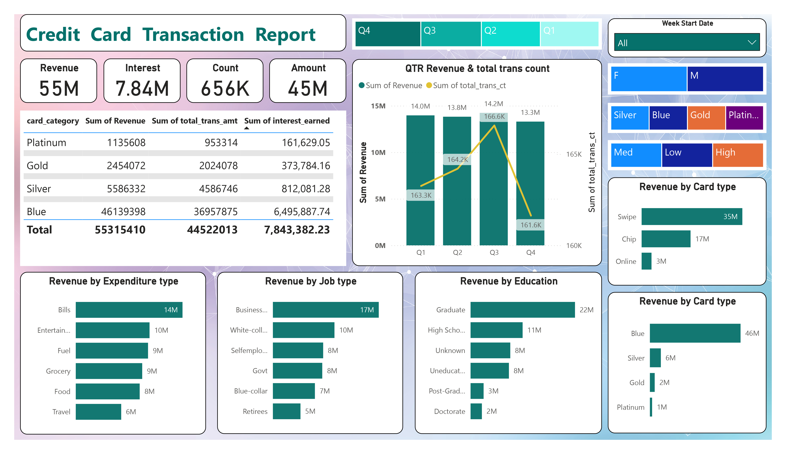
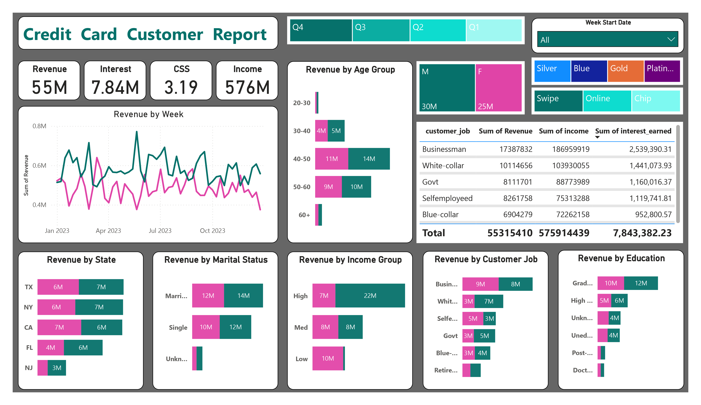

# 💳 Credit Card Analysis Dashboard (Power BI)

This repository contains two interactive Power BI dashboards designed to provide in-depth insights into **credit card transactions** and **customer behavior**.

## 📊 Dashboards Overview

### 1. Credit Card Transaction Report
This dashboard focuses on overall transaction data and card performance:
- **Total Revenue:** $55M
- **Interest Earned:** $7.84M
- **Total Transactions:** 656K
- **Key Insights:**
  - Blue card generated the highest revenue ($46M)
  - Most revenue comes from bills, entertainment, and grocery expenses
  - Q3 had the highest transaction count and revenue

### 2. Credit Card Customer Report
This dashboard provides a customer-centric view of credit card usage:
- **Customer Satisfaction Score (CSS):** 3.19
- **Total Income:** $576M
- **Key Insights:**
  - Highest revenue from businessmen and graduates
  - Most active age group: 40–50 years
  - Married and high-income customers contribute most to revenue

## 🎯 Objectives
- Analyse credit card usage trends by card type, job, education, and demographics.
- Understand customer behaviour to assist in strategic marketing.
- Identify the most profitable segments and time periods.
- Improve data-driven decision-making for credit card companies.

## 📎 Tools Used
- **Microsoft Power BI**
- **Data Visualization & DAX**
- **Interactive Slicers and Filters**

## 🖼️ Screenshots

## 🧠 Insights & Recommendations
- Focus marketing on Blue card users and 40–50 age group.
- Introduce reward programs for fuel, grocery, and bill payments.
- Leverage graduate and business demographics for premium offers.

## 📁 File Structure
